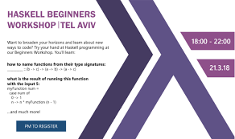

# Table of Contents

1.  [Welcome to Org mode](#orgb982db0)
2.  [This is a headline, it starts with one or more stars](#orgb9efc1c)
3.  [Working with lists](#orgd392ab6)
    1.  [Moving around in our outline](#org79f1512)
    2.  [Lord of the Rings](#orge84cd34)
    3.  [Source Code.](#orgc125129)
    4.  [New Entry](#orge1f64c3):ATTACH:

# Welcome to Org mode

Welcome, and thanks for trying out Org mode. Making outlines in
  Org is very simple. It is just text! Just start typing.

# This is a headline, it starts with one or more stars

A heading has one star, a sub-heading two, etc.

# Working with lists

## Moving around in our outline

Hello I am just an outline

## Lord of the Rings

My favorite scenes are (in this order)

1.  The attack of the Rohirrim
2.  Eowyn's fight with the witch king
    -   this was already my favorite scene in the book
    -   I really like Miranda Otto.
3.  Peter Jackson being shot by Legolas
    -   on DVD only

He makes a really funny face when it happens.
But in the end, no individual scenes matter but the film as a whole.
Important actors in this film are:

-   **Elijah Wood:** He plays Frodo
-   **Sean Austin:** He plays Sam, Frodo's friend.  I still remember
    him very well from his role as Mikey Walsh in The Goonies.

g You can make words **bold**, *italic*, underlined, `code` and `verbatim`, and, if you must, <del>strike-through</del>.

## Source Code.

    object SalaryRaiser {

      def smallPromotion(salaries: List[Double]): List[Double] =
        salaries.map(salary => salary * 1.1)

      def greatPromotion(salaries: List[Double]): List[Double] =
        salaries.map(salary => salary * math.log(salary))

      def hugePromotion(salaries: List[Double]): List[Double] =
        salaries.map(salary => salary * salary)
    }

## New Entry     :ATTACH:

